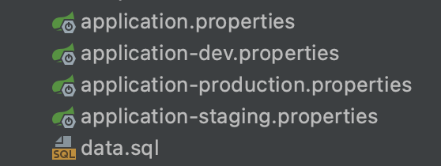
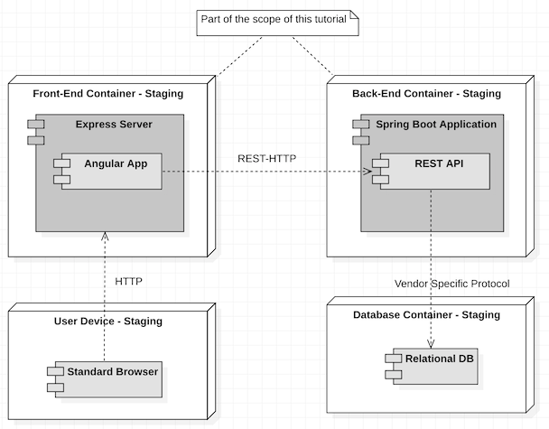
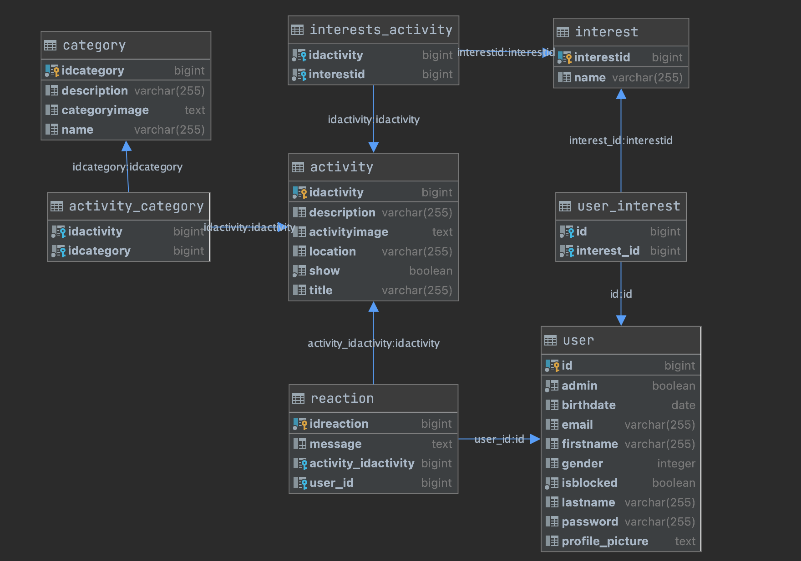

# Digital Life Web application installation guide

**[About the Web Applications Installation and Configuration Guide](#about-the-web-applications-installation-and-configuration-guide)**

**[Introduction](#introduction)**

**[Product vision](#product-vision)**

**[Layered Architecture Package Diagram](#layered-architecture-package-diagram)**

**[Navigable Class Diagram](#navigable-class-diagram)**

**[Challenges and alternative](#challenges-and-alternative)**

**[Important epic stories](#important-epic-stories)**

[Speech recognition](#speech-recognition)

[Application is manageable as an admin](#application-is-manageable-as-an-admin)

[Users are able to make an account and edit it later](#users-are-able-to-make-an-account-and-edit-it-later)

[All activities overview with filters and search bar](#all-activities-overview-with-filters-and-search-bar)

[All categories have their own page with every activity of that category](#all-categories-have-their-own-page-with-every-activity-of-that-category)

[The website gives a few suggestions for the user of activities that they may like according to their interests](#the-website-gives-a-few-suggestions-for-the-user-of-activities-that-they-may-like-according-to-their-interests)

[General information](#general-information) 

[Running the client](#running-the-client) 

[Using the Client API](#using-the-client-api) 

[Database configuration](#database-configuration) 

[Using RESTful API](#using-restful-api)

**[Database Postgres EERD](#database-postgres-eerd)**

**[UML system documentation](#uml-system-documentation)**


**[Deployment Diagram](#deployment-diagram)**

**[Postgresql EERD](#postgresql-eerd)**

**[Analytical reflection](#analytical-reflection)**


## About the Web Applications Installation and Configuration Guide


## Introduction

This document has been created to clarify the functionalities of our EWA product. Activities web application for elderly people that has been developed by team 5 in order of Digital-Life.

- Enterprise Web Application is developed using Spring Boot(backend) with Angular(front-end) framework.
- Project is focused mainly on handling document based projects.
- &quot;User&quot; can choose activities by filtering them on a specific category
- &quot;User&quot; can change the colors of the website by giving a command to the speech recognition
- Admin can manage the activities/categories/users like adding, deleting and editing them
- This web application is secure and robust. We have implemented JWT based Authentication technique in our application. The user will be logged out after an hour and directed to the login page.
- Using Postgres and Spring Data JPA for database management.

##


##


## Product vision

An Enterprise Web Application that aims at helping the users (elderly people) with visual impairments to do all kinds of activities that they&#39;d like to do by finding an activity that suits their interests.

Absolutely there is a possibility to choose interests when creating a new account, which will help the user to see the appropriate activities based on the selected interests. The activities are divided into categories, to make it easier for the user to find certain activities of a certain category. By using the filter, it is possible to find the needed category/activity.

During the development process, we had to test the application with real users with visual impairments to improve the application based on the user&#39;s feedback. We tested the application with several color combinations to find out which color is the best to choose. But that was difficult since color blindness affects people in different manners and that makes it difficult to choose a safe color that applies to all colorblind users. To have this problem solved, we&#39;ve built a speech recognition to help the user to apply the color as preferred. This function distinguishes our application from other applications since the possibility of changing the color at other websites is not easy to find. By clicking on the mic the user can give a command to change the color of the whole website and it&#39;s also possible to navigate through the app by using this speech recognition. We have made progress also by making it possible to change the color by clicking on a drop-down from the menu bar and choosing the preferred color. These features have helped us to feel confident since these features are rarely implemented in other applications (competitors) like Uitjes.nl, which has limited features for the user to use. That will undoubtedly help us to attract more users to enjoy our services that we&#39;ve provided in our application.

## Important epic stories

- Speech recognition
- Application is manageable as an admin
- Users can make an account and edit it later
- All activities overview with filters and search bar
- All categories have their own page with every activity of that category
- The website gives a few suggestions for the user of activities that they may like according to their interests

## Speech recognition

Our website is designed for people with visual impairments. So that means that they can&#39;t see everything on the website very well. For those users, we have implemented a speech recognition function which the user can use to change the color of the website and navigate throughout the website. The usability had to be very straightforward, so when the user enters the site for the first time a voice says that there is a button at the top of the website where the user can talk to. The speech recognition function uses a few keywords, which is very handy because the user can speak in full sentences and the website will know what to do because of the used keywords. When a user has navigated to an activity there is another function that reads out the description of the activity.

## Application is manageable as an admin

The website is very manageable for the admins, an admin gets an extra button in the navbar at the top of the website. With that button, the admin will be redirected to a page with all the admin functions. The admin functions include 3 tabs, one for user-management, one for activity-management and one for category-management. In those tabs, the admin can change all the details of the activities and categories and they can delete them as well. The admin can also block users and make other users admin.

## Users are able to make an account and edit it later

On our website, users can make their own accounts. Based on their account the website will give the user a few activities that they may like. If a user is logged in they can leave reactions on activities as well. If a user would like to change their information they can. On their profile page, the user can change all their details, if the user does that the suggested activities will change as well.

## All activities overview with filters and search bar

The website consists of a page where all activities are shown together where users can sign up for. The activities are divided into different categories and users are able to filter based on the category. Because of this users can see only the activities which they like. Besides this, users also have the option to type a certain activity in the search bar found on top of the overview page. So if the user has a specific activity in mind which they find interesting, they can type it in the bar and see if it is available.

## All categories have their own page with every activity of that category

On the home-page of the website, all categories are displayed as cards. If a user clicks on one of those cards, the user will be redirected to the page of that category. On that page, all activities which are related to that category are displayed. The user can search through those activities with a search bar that looks through the activities and displays only the activities that have any attribute which matches the search input.

## The website gives a few suggestions for the user of activities that they may like according to their interests

When a user has made an account on the website. The interests that they have selected are compared to the categories linked to all of the activities. This is what the matching functionality is used for. By comparing the interests to the categories of the activities we are able to show only the activities where the categories accord to their own interests. This means the user will only see activities where they are interested in. A user can always change their interests later if they prefer to see more activities that they may like or if they simply forgot to add one to their profile.

## Layered Architecture Package Diagram


**Presentation Layer:**

The frontend of the application. Contains HTML/CSS and web framework Angular. This layer displays the data it retrieves and does as little &quot;thinking&quot; as possible.

- Package view:contains the components that are displayed for the user, these components are built using HTML,CSS and Angular framework
- Package services:contains the important CRUD functionalities, it takes of sending/receiving and mapping data from the application layer
- Package models:contains the models that are used to display the data, once the data have been retrieved and mapped by a certain service into one of these models for a certain component.

**Application Layer:** This is the middleware of our application (as shown in the previous picture of the packages). It has been implemented in Java using the spring-boot framework. This layer is the &quot;engine&quot; of our app and it connects the presentation layer to the data layer. We do not want any Views or UI in this layer, as this is the &quot;great thinker&quot; of the squad.

- Exception package: has multiple exception classes that are used in other controllers, repositories and utilities like in JWttoken class which will throw an exception if the token invalid/wrong. Also, they are used in repositories for a certain situation like logging in with a wrong password/email.

- Package service: has ApiConfiguration that implements WebMvcConfigurer and initializes JWToken of the package utility

- Package models: Some models are used in other models like User has one/many interests, also models are used in controllers, for example,userController would get a request to get the user information on a certain endpoint and the response will be a user which is a model

- Package rest: Some controllers use the service ApiConfiguration to decode the token that is given in the header of the request that is done also by using the utility JWToken that has the encode and decode methods. Some controllers will throw an exception on a certain situation as mentioned previously, which means they create an exception of the exception package

- Package repositories: Some repositories depend on another repository, like userRepository is depending on the InterestRepository because if we need to get for a certain user his/her interests we need to use the InterestRepository. Each repository is of a specific type of model.

- Package utilities: This package contains the JWToken utilities, like JWToken class which has the functionality to encode and decode the sent/received token. In addition, it takes into account the expiration time of each token by encoding the expiration time of each token and decoding to check if the token is still valid when the client makes a request.

**Data Layer:** Our database/storage system. It is PostgreSQL for production environment and h2 for development environment. The data would be accessed by the application layer via API calls (the API call itself is triggered by the presentation layer, but the presentation layer doesn&#39;t know what the application layer will do with that call, it&#39;s a blackbox between the two) these calls are managed by controllers that are using JPA repositories. The repositories use persist/merge the given entity by the controller. Hibernate takes care of mapping Java classes to database tables using XML files.

## Navigable Class Diagram

This is the whole class diagram of our application, the relation between each repository and controller is clearly given in each controller class

Below is an explanation of the class diagram:


**Models**

Each category has multiple activities and vice versa.

Each user has multiple interests and vice versa, and each activity has multiple interests and vice versa.

Each activity has zero/multiple reactions and each user has zero/multiple reactions.

**Repository**

Each modal has its own repository. The repositories are used to get the data from the database, like deleting, editing and saving. Also, repositories have their own functionalities like findByEmail in UserRepository which finds a user based on the given email. Not every Repository has the same functionalities. General functionalities for each Repository are implemented from the EntityRepository like findAll,findById, saveOrUpdate and deleteById.

**Controllers**

We need controllers so clients can make requests and get responses. all these things go through the controller. If a client wants to log in, they go to the login page. This is an example of a request that is made in the controller. Another example is if a client wants to see all the activities. To see all the activities the client has to go to the actual page. This is also a request.

**Service**

In the service package, there is only one file. This file is the APIConfiguration file. This file is used for security. In this file is specified which origins can communicate with the backend of our application. In this file, the token given to a logged-in user is decoded en checked if it is a correct token

**Exception**

Each exception will be thrown at a specific situation for example if the user has entered a wrong password/email

**Utilities**

The JWToken is to be used when encoding/decoding the token of the user, which will be stored in the sessionStorage.

JWTRequestFilter to check(The toke )and filter the requests of the client

##


## Challenges and alternative

The biggest challenges had to do with the visual impairment of our target audience. Because we didn&#39;t have any experience in this regard it was hard for us to figure out the best way to design our application. After discussing and experimenting with different things we came to the conclusion that we wanted to implement some features to help our users out. Features like speech recognition were a great solution for this. Because of the speech recognition, users are able to change the colors of the application, they can navigate through the entire application as well and different forms of text can also be read out loud if the users prefer that.

After some sprint reviews, we received feedback that it would be great if we could find another way to assist the users with their visual impairment next to the speech recognition. This is where we came up with the idea to make two buttons in the navigation bar, a plus button and a minus button. With these buttons, people can increase and decrease the font sizes of all text in the application. By doing this our users have the option to adjust the font size accordingly to their liking. This way they are able to read the text which is shown in the application, even when they have a visual impairment.

An alternative solution to the unreadable text for some users could be that we entirely changed the font sizes all over the website accordingly so that everyone would be able to read the text. This would likely have been a simple solution but we didn&#39;t choose to solve the problem like this because there are still going to be people who are still able and prefer to read the smaller font sizes. Also, the admin users would most likely prefer that the font sizes aren&#39;t too big. The two buttons that can adjust font sizes are the perfect solution for this, everyone can adjust the font sizes to whatever size they like.

##


## Deployment Diagram


**Back-end(server-side):**

Here we have the controllers and repositories that are necessary for our product to make API calls to the Database to retrieve the needed data for a certain request, that is made by the user. For security purposes, we&#39;ve implemented the JWToken to track the user&#39;s behavior during visiting our app and making sure that the user will be logged out after an hour of activeness on our app.

**Front-end (client-side):**

Contains HTML/CSS and web framework Angular. This layer shows the data that has been retrieved and does as little &quot;interacting&quot; as possible. We have used extern scripts like bootstrap and jquery for design purposes.

**Database:**

As shown in the figure below, we used PostgreSQL database to store/retrieve data

## 


## Postgresql EERD

In our EERD we have eight entities. The most important entities are the User, Activity, Interest, Reaction and category. The relation between the activity and category entity is many to many because an activity can belong to one or more categories and each category can have one or more activities that belong to it.

In this case, we created the table &#39;activity\_category&#39;. Another table that exists due to the many to many relationship is the &quot;user\_interest&quot;. A user can have one or more interests and also an interest can belong to one or more users. The third between table is the &quot;interest\_activity&quot;. An activity can belong to an interest, but also an interest can have one or more activities that belong to it.

The entity without a many to many relation is the reaction entity. This entity has a many to one relation with the entity activity, a reaction belongs only to one activity and an activity has one or many reactions. The relation between reaction and user entity is a many to one relation. A user can have one or more reactions, but a reaction belongs to one user.

## 


## Analytical reflection

Due to the problems that our target group (elderly people with visual impairments) have, we had to be careful with choosing the right color and contrast design. Before we started with designing we researched partially-sighted people. We made a few colored sketches to test them with real users that are partially-sighted, it was impossible to determine which color is the safest to use in our design because each user has seen the color in a different manner than reality.

We had to use colors with high contrast to make sure that the colors aren&#39;t annoying for our target group. The problem was way bigger than we thought, that&#39;s why we had to implement speech recognition to make it possible for our target group to change the color of the website as preferred. However, that was not user friendly for the majority of our elderly target group, so we needed to make a drop-down menu item with standard colors, by just clicking on one of these colors the whole app will be colored with the selected color.

Also, we&#39;ve taken into account that most of our users are not familiar with modern technology, due to that we extended our speech recognition by adding an extra feature to navigate through the app by giving a command to the speech recognition and that makes it more user friendly.

Therefore, we tested our app again to get feedback on what we&#39;ve added to our app, the users were enthusiastic about the features we added. There was negative feedback about the multiple filters on the home page, the user had to fill all filters to find an appropriate activity/category. We decided to remove the unnecessary filters and place just one search filter instead.

Also, the menu bar wasn&#39;t that clear for some users, because we used icons to refer to a certain page, we&#39;ve been advised to add text below each icon to make it more distinct about what the icon means.

The registration page was also redesigned, because in the beginning, we had checkboxes for the interests, many users didn&#39;t even see the interests while registering. In other words, they&#39;ve skipped choosing an interest. Therefore, we&#39;ve converted the checkboxes into reasonably large pictures.

Font-size was a bit annoying for the most partially-sighted users, they had difficulties reading the text properly because the font-size wasn&#39;t readable. We&#39;ve tried to use a global font-size that would be readable for all users, again that was in vain so we had to add a feature to make it possible to change the font-size of the whole app by just clicking on the minus/plus button of the menu bar.


## General information

The Web Applications Installation and Configuration Guide describes the configuration settings needed to install the Digital Life web application. It assumes you have cloned the project on your machine, if you didn&#39;t clone the project yet you can start cloning the project

| git@gitlab.fdmci.hva.nl:se-ewa-2020-2021/digital-life-5.git |
| --- |

you can also try the HTTP version if the SSH version does not work for you:

| https://gitlab.fdmci.hva.nl/se-ewa-2020-2021/digital-life-5.git |
| --- |

Now you are ready to run the application.

### **Running the client**

Go to the directory cd fe-app

First, you should install the dependencies.

| npm install |
| --- |

Ti start the server use the following command:

| npm start |
| --- |

It will start a server running on port 8080.

###


### **Using the Client API**

We have built a simple front-end application to demonstrate how event handling can be managed on the client-side.

You should install Angular first. If you do not have it yet, go to cd fe-app and run the following command in your terminal:

| npm install -g @angular/cli |
| --- |

More information about the Angular environment can be[found here](https://angular.io/guide/setup-local).

To run the application, you should first install dependencies in the root folder of the front-end application.

| npm install |
| --- |

Then, you can start a local server, by running this command in the root folder of the front-end application.

| ng serve |
| --- |

It will run on port http://localhost:4200/

The project is divided into two files &#39;fe-app&#39; and &#39;be-app&#39;. The &#39;fe-app&#39; contains the files of the frontend (client-side) and the &#39;be-app&#39; contains the files of the backend (server-side).


In the &#39;be-app/src/main/resources&#39; you find four different files of application.properties as shown below



The application.properties file is the main file of the rest of the properties files, in this file you&#39;re able to choose which configured file you&#39;d like to run for example by changing the value of ```spring.profiles.active=<value>```

in application.properties into ```spring.profiles.active=staging```

The application will use the file application.staging.properties, which might have a different configuration than the application.dev.properties

One of the requirements for EWA applications is storing and retrieving data from a relational database. A typical EWA application is composed of at least three physical layers: the front-end node, the back-end node and the database node. The figure below presents a deployment diagram of an EWA app.



### **Database configuration**

When installing the project you may want to run it on a certain database and this is possible by configuring a certain file of the application.properties sub-files for example:

- the application-staging.properties/application-production.properties below contains the necessary parameters to use for your database.
```java
| // setting the database
//note: dialects are auto detected by hibernate
 spring.datasource.url=<jdbc-url>
 spring.datasource.username=<user>
 spring.datasource.password=<password>

//drop and create table again, good for testing, comment this in production
 spring.jpa.hibernate.ddl-auto=create
//used to initialise the db with data
 spring.datasource.initialization-mode=always
 spring.datasource.data=classpath:/data.sql

//turn statistics on
 spring.jpa.properties.hibernate.generate\_statistics=true
 logging.level.org.hibernate.stat=debug

//show all queries
 spring.jpa.show-sql=true
 spring.jpa.properties.hibernate.format\_sql=true
 logging.level.org.hibernate.type=trace

```


If you&#39;re done configuring your database you can tell spring boot which configuration you want to run by setting that in your main application.properties for example if you have configured the application-production.properties, you can set that in you can set in the main application.properties spring.profiles.active=production

In case that you want to use the development environment you can set that in your

main application.properties as follows:

| spring.profiles.active=dev |
| --- |

That will use the application-dev.properties, which has configuration that runs on your [http://localhost:8080/](http://localhost:8080/).

## Configuration SMTP server
You can also adjust the email configuration in one of the application.properties sub-files to be able to send emails if the user wants tp reset the password
 these configurations are like username, email and password as shown below

```java
spring.mail.host=smtp.gmail.com
spring.mail.port=587
spring.mail.username=<emai>
spring.mail.password=<password>.

//Other properties
spring.mail.properties.mail.smtp.auth=true
spring.mail.properties.mail.smtp.connectiontimeout=5000
spring.mail.properties.mail.smtp.timeout=5000
spring.mail.properties.mail.smtp.writetimeout=5000

//TLS , port 587
spring.mail.properties.mail.smtp.starttls.enable=true

```

## Using RESTful API

To interact with the API, you should download an HTTP client. For this we recommend you using Postman. The following link allows you to get a collection of examples to interact with the API.

Below, a summary of operations:.

Do not forget to add the token when making requests. You can use the Authorization Tab \&gt; Bearer Token and paste the token to make requests. If the token was not provided or is invalid, a 401 message will be returned. In other words for some requests you need to log in first for example:

If you make request to [http://localhost:8080/user/all](http://localhost:8080/user/all) and you are not logged in yet, you will get an exception of status: 500, which indicates that you&#39;re not authenticated yet and you need to log in as an admin to see the users, otherwise you will get an exception of status 403 that means you&#39;re not allowed to see the users.

###


## Database Postgres EERD




