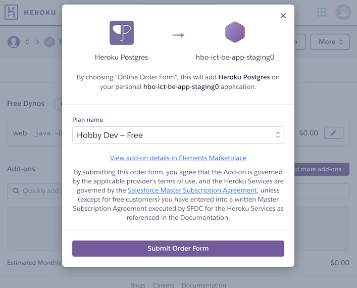
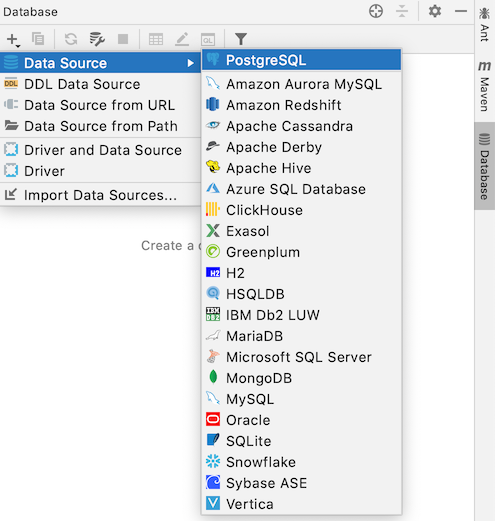
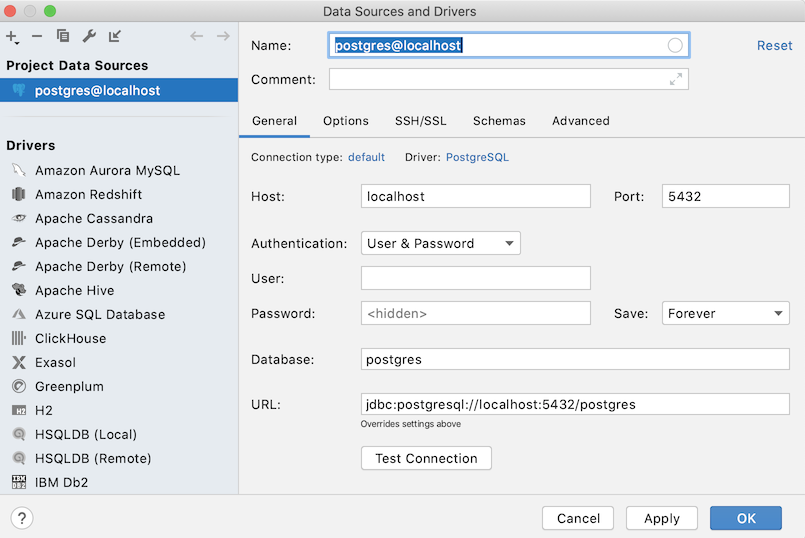
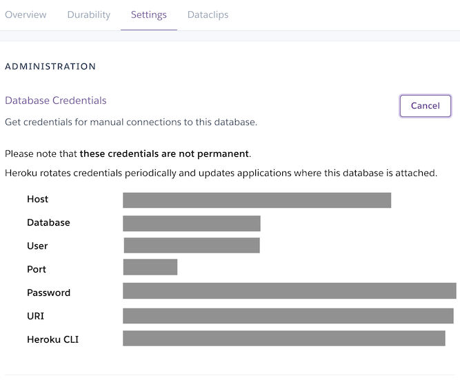
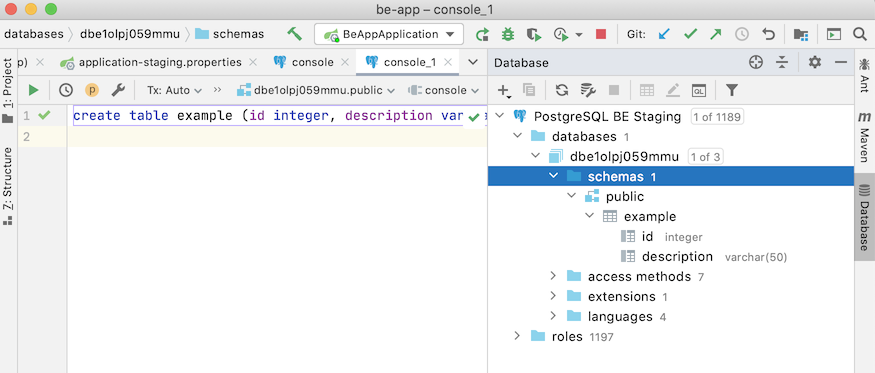

# Configuring a database for your application

One of the requirements for EWA applications is storing and retrieving data from a relational database. A typical EWA application is composed by at least three physical layers: the front-end node, the back-end node and the database node. The figure below presents a deployment diagram of an EWA app.


Relational databases are very popular, and one of the reasons for its prevalence is the variety of applications using it and vendors offering this technology and the level of maturity of more than 40 years of existence. This part of the tutorial covers the configuration of a database to be used by your back-end application. The remaining sections present a step-by-step process to prepare your app. 

Two choices are offered (please select one or another): 

- Configuring a MySQL database in the HvA Oege server 
- Configuring a PostgreSQL database as a Heroku service.

## MySQL from the Oege server

MySQL is an open-source relational database management system widely used. Oege is a server to support students, including database access. You can configure your MySQL database through the web-based panel (https://oege.ie.hva.nl). 

You can manage your database through the phpMyAdmin page. We assume that you already have an account. If not, you can request a new one.

## PostgreSQL as a Heroku service

PostgreSQL is a popular relational database management system (RDBMS). Millions of developers and companies rely on PostgreSQL as their transactional data store of choice to drive application health and decision-making ([find out more here](https://www.heroku.com/postgres)).

Heroku offers a PostgreSQL service, which includes a free version. This version comes with some limitations. For example, it allows storing a maximum of  1GB of data and allows for a maximum of 20 simultaneous connections. [Click here](https://elements.heroku.com/addons/heroku-postgresql) to know more about the existing plans. In the EWA context, these limits are sufficient for the majority of applications.

### Adding PostgreSQL service

A PostgreSQL add-on can be configured for a Heroku app. To do so, we recommend the creation of a new application to contain your database. Note that it is possibile reusing one of the existing apps (FE,BE), but we recommend a separation of concerns.

Instructions:

- [Login to Heroku](https://heroku.com/) 
- Create a new application and give a meaningful name (e.g. my-ewa-app-db-staging)
- Go to the *Resources* tab and search for Postgres. Select the *Heroku Postgres service* from the drop-down list.



- Select the *Hobby Dev - Free* plan
- Wait some seconds for the service to be configured and made available. It will be visible as soon as the server is up.

## Accessing the database from your IntelliJ IDEA

A common activity in the development phase is preparing the database, creating tables, indexes, populating it with data, and executing queries. Thus, a SQL client is an essential tool.

We are using the IntelliJ IDEA embedded SQL client in this tutorial. Let's configure it.

- Open IntelliJ IDEA
- Open the *database* tab located at the right-hand side of the UI. Click on the (+) sign, and add a MySQL or PostgreSQL datasource. If this is the first time you are using this db, the IDE will download the driver.



Next, a form with connection parameters will appear.



It is time to get all the connection parameters of your newly created database.

### Getting the connection parameters from your Oege MySQL instance 

Here, the typical values to fill in for a oege MySQL database

- Host: oege.ie.hva.nl
- Port: 3306 (standard port of MySQL)
- Database: check your database name in the phpMyAdmin panel, "databases" tab.

### Getting the connection parameters from your Heroku Postgres service

- Go back to the app dashboard at Heroku
- Select the *resources* folder and select the *Heroku Postgres* service.
- You will be redirected to the database dashboard
- Select the settings tab, and click on the *reveal credentials* button. Here you can see all necessary information like host, post, user, password and database
- Now you will see all the necessary information to fill the form and connect to the database. 



### Filling the connection form

- Go back to the IntelliJ IDEA configuration 
- Inform the connection name (e.g. "BE Database Staging")
- Inform the host and port, user, password and database
- Click on the *Test Connection* button to check if everything is correctly configured.


>Important: You will see that the URL for the JDBC connection field was created based on your provided configuration. Copy this content to be used in the upcoming steps. You will needed it during the database configuration of your application.

Now you can spend some time getting used to the tool (connecting to the database, opening a query console, creating a simple table, executing an insert statement, performing a query, etc.)

> The schema management is your responsibility. Depending on the way you configured your JPA application, all tables, fields and constraints will be created automatically. If you opted to create your tables manually, make sure to disable the schema auto-generation, and mapping the table names and fields with your domain model classes using JPA annotations.



## Configuring Spring Boot to use your database

We are working in two files to make sure that your application uses Postgres. The `pom.xml` files to add the driver, and the `application.properties` to configure your database URL.

### Changing the pom.xml file

Make sure that you have the *data JPA* dependency in your pom.xml file. 

```
<dependency>
    <groupId>org.springframework.boot</groupId>
    <artifactId>spring-boot-starter-data-jpa</artifactId>
</dependency>
```

Add the JDBC driver dependency inside the *dependencies* tag. It will make sure that you have the database driver to be loaded within your app.

**For a MySQL database**
```
<dependency>
    <groupId>mysql</groupId>
    <artifactId>mysql-connector-java</artifactId>
    <scope>runtime</scope>
</dependency>
```

**For a PostgreSQL database**
```
<dependency>
    <groupId>org.postgresql</groupId>
    <artifactId>postgresql</artifactId>
    <scope>runtime</scope>
</dependency>
```

>Sometimes the dependencies are not updated automatically. If this is the case, you can refresh the project in the *Maven* tab.

### Changing the application.properties file

First, make a copy of your application.properties file to application-dev.properties. We are using it in the next step. Now, you can open the applicaton.properties.

The application.properties below contains the necessary parameters to use your database. 

```
# setting the database
# note: dialects are auto detected by hibernate
spring.datasource.url=<your-jdbc-url>
spring.datasource.username=<user>
spring.datasource.password=<password>

# drop and create table again, good for testing, comment this in production
spring.jpa.hibernate.ddl-auto=create
# used to initialise the db with data
spring.datasource.initialization-mode=always
spring.datasource.data=classpath:/data.sql

#turn statistics on
spring.jpa.properties.hibernate.generate_statistics=true
logging.level.org.hibernate.stat=debug

#show all queries
spring.jpa.show-sql=true
spring.jpa.properties.hibernate.format_sql=true
logging.level.org.hibernate.type=trace
```

Make sure to update the URL, user and password from the "*setting the database*" section.

This application is configured to drop and create the database, which is very useful for testing purposes. If you wish to create the schema only once and update whenever modifications are made, you can change the value spring.jpa.hibernate.ddl-auto to *update* and you can comment the spring.datasource.initialization-mode line. 

The remaining parameters are useful for debugging purposes.

After your changes, test your application using your new datasource.

## Preparing your application to deploy to the staging environment

At this point, your application is fully linked to the configured database. This might be very practical for a simple test, but it is not the expected configuration for an EWA project. Your application should be prepared to connect to differnt databases depending on the environment you are deploying the app. For example, you should use the application with:

- an in-memory lighweight database when you are using the development environment;
- a MySQL or PostgreSQL database when you are using the staging environment
- another database when you are in the production environment.

Spring Boot has a handy feature called Application profile. In this tutorial we are covering the basics of this feature. To know more you can find the documentation [here](spring.datasource.initialization-mode=always)

### Multiple application properties

With this feature, you are allowed to have different property files for different environments. The sintax is `application-{profile}.properties`. For example:

- application-dev.properties
- application-staging.properties
- application-production.properties

Now, you should rename your application.properties file to application-staging.properties. We are assuming that your properties file is configured and tested to be used with your database.

You should have at this point two property files in your project: application-dev.properties (renamed previously), and application-staging.properties.

Spring boot selects the properties file based on the variable `spring.profiles.active=dev`. This variable can be informed via command-line interface or via the default application.properties.

For your development environment we are configuring the environment via application.properties. Create again this file, but with only the following content:

```
spring.profiles.active=dev
```

You can also start the Spring Boot App using command-line parameters:

```
java -jar -Dspring.profiles.active=dev
```

or via *run > Edit Configurations, specifying -Dspring.profiles.active=dev* in the VM parameters*

Now it is time to test if your application is working in development environment using the -dev configuration.

#### Selecting the right properties file when deploying to Heroku

To configure your Heroku application to use the staging environment, create an environment variable, using the following command:

```
heroku config:set -a <the-app-your-db-is-hosted> SPRING_PROFILES_ACTIVE=staging
```

With this configuration, heroku will start the spring boot application, specifying the profile set in the SPRING_PROFILES_ACTIVE variable, which has the value equals to *staging*. Thus, the application-staging.properties will be used to configure the app.

 Now it is time to deploy and test if your application is working properly with the MySQL or PostgreSQL database.

## Navigation

- [Previous Step: Manually Deploying your App to Heroku](/doc/general/deploy-to-heroku/README.md)
- [Home](/README.md)