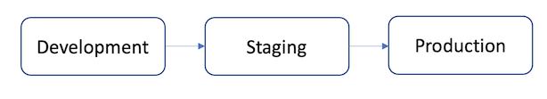

# The basics of the deployment process of web apps

Here we cover the basics of environments used in development projects: development, stage, and production:

The Development environment is where developers work on features and test the produced source-code. The most common environment in the local machine or on top of small containers like Docker. In terms of repository, depending on the workflow the team have chosen, developers work on a separate feature branch. 

When the developer is ready to commit changes, a merge request is submitted and someone from the team verifies and push changes to the development branch. When all the integrated features have been tested and the application is stable, developers merge the code to a staging branch. A deployment to the staging environment is started. 

A QA (Quality Assurance) is executed, and if everything is OK, the team merges changes to the production branch. A deployment to the production environment is started. 

This is an over-simplified scenario that introduces the key ideas to continuous methodologies (CI/CD):

- Continuous Integration ([CI](https://docs.gitlab.com/ee/ci/introduction/index.html#continuous-integration)): for every change submitted to an application - even to development branches - it’s built and tested automatically and continuously, ensuring the introduced changes pass all tests, guidelines, and code compliance standards you established for your app.

- Continuous Delivery ([CD](https://docs.gitlab.com/ee/ci/introduction/index.html#continuous-delivery)): Continuous Delivery is a step beyond Continuous Integration. Your application is not only built and tested at every code change pushed to the codebase, but, as an additional step, it’s also deployed continuously, though the deployments are triggered manually. This method ensures the code is checked automatically but requires human intervention to manually and strategically trigger the deployment of the changes.

- Continuous Deployment ([CD](https://docs.gitlab.com/ee/ci/introduction/index.html#continuous-deployment)): Continuous Deployment is also a further step beyond Continuous Integration, similar to Continuous Delivery. The difference is that instead of deploying your application manually, you set it to be deployed automatically. It does not require human intervention at all to have your application deployed.

This tutorial is focused on CI/CD. We are using Heroku as our deployment environment and GitLab as our repository and CI/CD environment

## Navigation

- [Next Step: Configuring a Heroku account](/doc/general/heroku-account/README.md)
- [Home](/README.md)