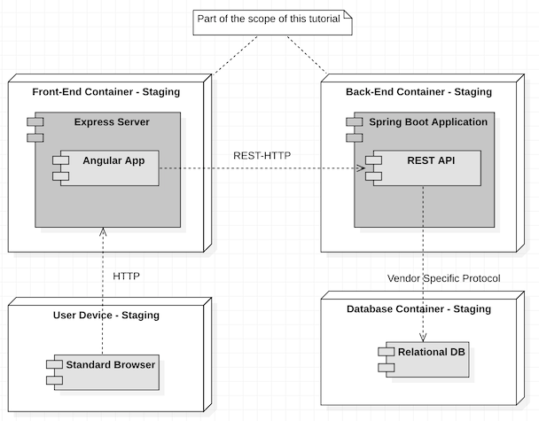

# Front-end Deployment

## Creating Heroku Apps

You need a Heroku account to proceed. If you don't have it yet, follow the instructions [here](doc/general/heroku-account/README.md).

This workshop assumes that you are deploying the front-end and the back-end in separate servers, physically distributed. The deployment diagram below, shows how we are configuring the staging environment:

> Note that there is an approach to host your Angular application inside your Spring Boot application, but this is out of the scope of this workshop. We want you experimenting the deployment process of your front-end, back-end and database as independent as possible.

First, you should first create two Heroku applications for the staging environment: One for the Front-end application and one Back-end Application. 

The easiest way to do it is using the Heroku Dashboard that is shown right after you login to Heroku.

Let's create the front-end application. After filling the project information, you will be redirected to the configuration page asking you how to deploy the app. 

> Make sure that you give a meaningfull and unique name, because this will be part of the URL of the app to the end user. Do not forget to add the environment that corresponds to the app (e.g. staging, production) so that it is easy to recognise it through the URL. In this example, I used the following names, with its corresponding generated URLS:
> * hbo-ict-fe-app-staging - https://hbo-ict-fe-app-staging.herokuapp.com/
>* hbo-ict-be-app-staging - https://hbo-ict-be-app-staging.herokuapp.com/

The Heroku Git is already pre-selected. In this workshop we are using this approach. This strategy allows you to link your git project to a remote repository at Heroku. The deployment starts when you push your changes to the Heroku repository.

Great! You have your application created! Now you should be able to see all configuration options like overview, deployment and settings. 

Now, execute the same steps to create the back-end application.

## Navigation

- [Next Step: Preparing your Angular Application](doc/fe/README.md)
- [Previous Step: Configuring a Heroku account](doc/general/heroku-account/README.md)
- [Home](/README.md)

